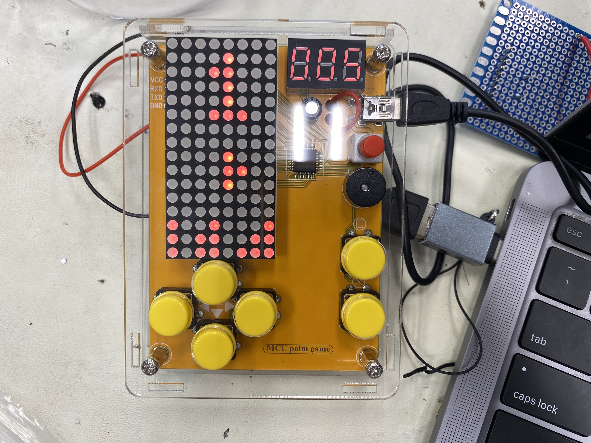

# Smart Glasses
pair of glasses that do object recognition 
You should comment out all portions of your portfolio that you have not completed yet, as well as any instructions:
```HTML 
<!--- This is an HTML comment in Markdown -->
<!--- Anything between these symbols will not render on the published site -->
```

| **Engineer** | **School** | **Area of Interest** | **Grade** |
|:--:|:--:|:--:|:--:|
| Riya N | Irvington High School | Electrical Engineering | Incoming Senior

**Replace the BlueStamp logo below with an image of yourself and your completed project. Follow the guide [here](https://tomcam.github.io/least-github-pages/adding-images-github-pages-site.html) if you need help.**


  
# Final Milestone

**Don't forget to replace the text below with the embedding for your milestone video. Go to Youtube, click Share -> Embed, and copy and paste the code to replace what's below.**

<iframe width="560" height="315" src="https://www.youtube.com/embed/F7M7imOVGug" title="YouTube video player" frameborder="0" allow="accelerometer; autoplay; clipboard-write; encrypted-media; gyroscope; picture-in-picture; web-share" allowfullscreen></iframe>

For your final milestone, explain the outcome of your project. Key details to include are:
- What you've accomplished since your previous milestone
- What your biggest challenges and triumphs were at BSE
- A summary of key topics you learned about
- What you hope to learn in the future after everything you've learned at BSE


# Second Milestone

**Don't forget to replace the text below with the embedding for your milestone video. Go to Youtube, click Share -> Embed, and copy and paste the code to replace what's below.**

<iframe width="560" height="315" src="https://www.youtube.com/embed/y3VAmNlER5Y" title="YouTube video player" frameborder="0" allow="accelerometer; autoplay; clipboard-write; encrypted-media; gyroscope; picture-in-picture; web-share" allowfullscreen></iframe>

For your second milestone, explain what you've worked on since your previous milestone. You can highlight:
- Technical details of what you've accomplished and how they contribute to the final goal
- What has been surprising about the project so far
- Previous challenges you faced that you overcame
- What needs to be completed before your final milestone 

# First Milestone

**Don't forget to replace the text below with the embedding for your milestone video. Go to Youtube, click Share -> Embed, and copy and paste the code to replace what's below.**

<iframe width="560" height="315" src="https://www.youtube.com/embed/bZwton4v0_g?si=MIdvZNEX-xEZbMlO" title="YouTube video player" frameborder="0" allow="accelerometer; autoplay; clipboard-write; encrypted-media; gyroscope; picture-in-picture; web-share" referrerpolicy="strict-origin-when-cross-origin" allowfullscreen></iframe>

My project that is the smart glasses I am using a rasberry pi and it's designated camera to perform object regontiiton and then attaching on to the glasses. For my milestone I Set up and connected to the Raspberry Pi to take a picture.

This entailed: 

Inserting the Micro-SD card into the USB reader and plug it into your computer

Do the imaging for the sd card which means duplicate their configured Raspberry Pi setups, back up their systems, or quickly deploy the same OS and software on multiple devices

Enable (SSH (Secure Shell) which lets you remotely control your Raspberry Pi from another computer without needing a monitor, keyboard, or mouse connected to the Pi) 

Run terminal commands from my PC

Edit code via VS Code

Transfer files between Pi and my computer

Insert the SD card into the Raspberry Pi., Put Raspberry Pi into the case

Monitor Setup via OBS and Connect the Raspberry Pi to your PC using the HDMI capture card

enable SSH and VNC and then change port number for SSH

VS Code and open it, Install the Remote - SSH extension
```python
from picamera2 import Picamera2, Preview
import time
import cv2
picam2 = Picamera2()
camera_config = picam2.create_still_configuration(main={"size": (1920, 1080)},
lores={"size": (640, 480)}, display="lores")
picam2.configure(camera_config)
#picam2.start_preview(Preview.QTGL) #Comment this out if not using desktop interface
picam2.start()
time.sleep(2)
im = picam2.capture_array()
im = cv2.cvtColor(im, cv2.COLOR_BGR2RGB)
cv2.imwrite('file.png', im)void setup() {
```
Connect the camera and use python code above to take a picture. 

I encountered a lot of challenges for my first milestone which included the VS code side bar not working, and the imaging not working on my computer. 
My next steps ...


# Schematics 
Here's where you'll put images of your schematics. [Tinkercad](https://www.tinkercad.com/blog/official-guide-to-tinkercad-circuits) and [Fritzing](https://fritzing.org/learning/) are both great resoruces to create professional schematic diagrams, though BSE recommends Tinkercad becuase it can be done easily and for free in the browser. 

# Code
Here's where you'll put your code. The syntax below places it into a block of code. Follow the guide [here]([url](https://www.markdownguide.org/extended-syntax/)) to learn how to customize it to your project needs. 

```c++
void setup() {
  // put your setup code here, to run once:
  Serial.begin(9600);
  Serial.println("Hello World!");
}

void loop() {
  // put your main code here, to run repeatedly:

}
```

# Bill of Materials
Here's where you'll list the parts in your project. To add more rows, just copy and paste the example rows below.
Don't forget to place the link of where to buy each component inside the quotation marks in the corresponding row after href =. Follow the guide [here]([url](https://www.markdownguide.org/extended-syntax/)) to learn how to customize this to your project needs. 

| **Part** | **Note** | **Price** | **Link** |
|:--:|:--:|:--:|:--:|
| Item Name | What the item is used for | $Price | <a href="https://www.amazon.com/Arduino-A000066-ARDUINO-UNO-R3/dp/B008GRTSV6/"> Link </a> |
| Item Name | What the item is used for | $Price | <a href="https://www.amazon.com/Arduino-A000066-ARDUINO-UNO-R3/dp/B008GRTSV6/"> Link </a> |
| Item Name | What the item is used for | $Price | <a href="https://www.amazon.com/Arduino-A000066-ARDUINO-UNO-R3/dp/B008GRTSV6/"> Link </a> |

# Other Resources/Examples
One of the best parts about Github is that you can view how other people set up their own work. Here are some past BSE portfolios that are awesome examples. You can view how they set up their portfolio, and you can view their index.md files to understand how they implemented different portfolio components.
- [Example 1](https://trashytuber.github.io/YimingJiaBlueStamp/)
- [Example 2](https://sviatil0.github.io/Sviatoslav_BSE/)
- [Example 3](https://arneshkumar.github.io/arneshbluestamp/)

To watch the BSE tutorial on how to create a portfolio, click here.

# Starter Project

<iframe width="560" height="315" src="https://www.youtube.com/embed/_SmJnlM9aK0?si=IGL8JqboFfbL3MUj" title="YouTube video player" frameborder="0" allow="accelerometer; autoplay; clipboard-write; encrypted-media; gyroscope; picture-in-picture; web-share" referrerpolicy="strict-origin-when-cross-origin" allowfullscreen></iframe>

The starter project I did was the Retro Arcade Console. It was a soldering heavy project that had many interesting steps and components. First I attached the USB socket (Serves as the power source) and the Dot matrix (the screen) with soldering. Then I attached many other important components like the capacitors, buzzer and power switch. After, I attached the keys and the timers and also added a battery option for power. The console has many classic games like tetris and spaceshooter and it was pretty fun for such a small console and simple project. 


